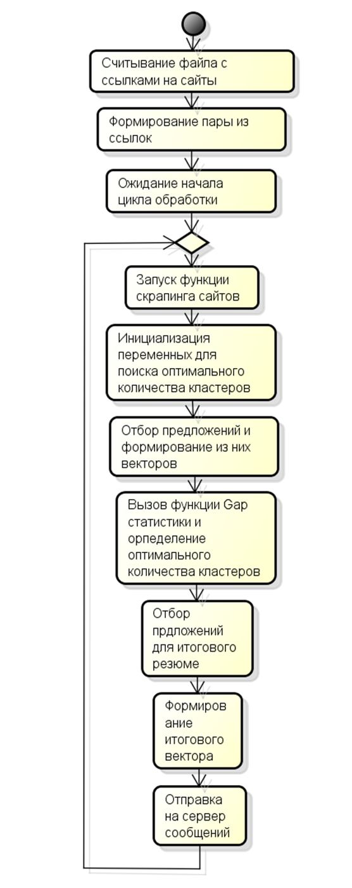

# WebSparkScraper
#  	Построение программной системы для извлечения информации из текстовых данных новостных сайтов с применением технологий больших данных 

Развитие информационных технологий ускорило обмен данными. Большой объем электронных новостей создал проблему: люди не успевают знакомиться со всеми новыми сообщениями. Краткие содержания помогают экономить время. Автоматическое суммирование может создать краткую выжимку из новостей.

## 📋 Описание
Программная система по извлечения информации из текстовых данных новостных сайтов с применением технологий больших данных состоит из следующих классов:
-	RecurrentWebScraper, основной класс программной системы, который содержит основные функции вызывающие обработку сайтов, формирование векторов, а также передача итогового вектора на сервер сообщений;
-	WebScraper, класс, который наследует интерфейс Interface и выполняет запуск браузера в свернутом режиме и получает текст старицы и ссылки найденные на новостном сайте;
-	Gap, содержит методы Gap-статистики, которые выполняют роль нахождения оптимального количества кластеров:
-	MapPartitionsSupport, класс, обеспечивающий преобразование RDD посредством MapPartitions, который выполняют преобразование частями, что положительно сказывается на времени выполнения;
-	partBert, данный класс выполняет загрузку словаря на основе файла содержащего слова, части слов;
-	Vocabular, класс содержит метод токенизирующий входной текст;
-	MQClient, класс, реализующий клиентское взаимодействие с сервером сообщений.

## Алгоритм работы системы извлечения информации

## ⚙️ Настройка
Настройка и запуск выполняются с помощью файла start.sh
